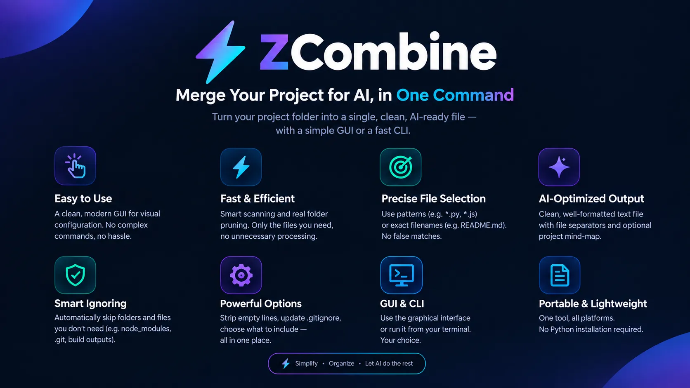

# ⚡ ZCombine (ZCM) — The Simple GUI Combiner Batch Generator
**A ridiculously simple, point-and-click graphical tool that builds a zero-dependency `.bat` script to merge your project files for AI.**

Stop wasting time opening, copying, and pasting dozens of source files into ChatGPT, Claude, or Gemini. **ZCombine** is a streamlined visual app that lets you easily select file extensions and folders to ignore, and then generates a standalone batch script tailored to your project. Run the generated script anywhere—no Python or GUI required—to get one clean, well-formatted text file ready for your favorite LLM.

---

## 🚀 Why ZCombine? (The ZCM Difference)

While other CLI tools require complex terminal commands or heavy runtimes, ZCombine is built for speed, ease of use, and maximum portability.

### 1️⃣ Modern Graphical Interface (No CLI Memorization)
Why remember syntax when you can click? ZCombine features a beautiful, dark-themed GUI (powered by CustomTkinter) that lets you visually configure your target file extensions (e.g., `py`, `js`, `html`) and ignore directories (e.g., `.git`, `dist`). Add or remove rules in seconds.

### 2️⃣ 100% Standalone, Zero-Dependency Output (The Game Changer)
This is what sets ZCombine apart. The GUI **does not** do the heavy lifting itself; instead, it acts as a builder that generates a highly optimized `zcm.bat` file in your project folder. 
- **Native Execution:** The generated batch file uses purely native Windows Batch and PowerShell commands. 
- **No Python Required:** You can commit `zcm.bat` to your Git repository, share it with your team, or run it on a completely different machine. **It works independently without needing ZCombine or Python installed.**

### 3️⃣ Context Menu & Global CLI Integration
ZCombine integrates directly into your workflow:
- **Right-Click & Setup:** Simply right-click any folder in Windows Explorer and select *"Setup ZCombine Here"*.
- **Global Command:** Open any terminal in your project directory and type `zcm setup` to instantly launch the configuration window.

---

## ✨ Key Features of the Generated Engine

The underlying `zcm.bat` engine is meticulously crafted for accuracy and performance:
- **Deep Recursive Search:** Penetrates deep into nested subdirectories without missing files.
- **Precise Folder Ignoral:** Uses exact boundary matching for ignored directories, preventing the common bugs where partial string matches accidentally skip important folders.
- **AI-Optimized Output:** Automatically strips empty/whitespace-only lines to save token space, and clearly separates each file with a visible header (e.g., `===== File: "\src\main.py" =====`).
- **UTF-8 Support:** Safely handles modern encodings without injecting BOMs (Byte Order Marks) that confuse AI models.
- **Auto-Gitignore:** The GUI can automatically append the generated scripts and output files to your `.gitignore`.

---

## 📦 Installation

If you are using the pre-compiled installer:
1. Run the `ZCombine Installer`.
2. The tool will automatically add itself to your system `PATH` and Windows Context Menu.
3. You are ready to go!

*For developers running from source:*
```bash
git clone https://github.com/cheloei/ZCM.git
cd ZCM
pip install -r requirements.txt
python installer.py
```

---

## 🕹️ Quick Start Guide

1. **Initialize:** Navigate to your project folder and run `zcm setup` (or use the right-click menu).
2. **Configure:** In the GUI, add the extensions you want to include (e.g., `cs`, `bat`, `xaml`) and the folders you want to ignore.
3. **Generate:** Click **"Generate Script"**. ZCombine will create a `zcm.bat` file tailored to your project.
4. **Run:** Execute the generated `zcm.bat` (by double-clicking it or running it in the terminal). 
5. **Result:** A `zcm_output.txt` file is instantly generated, perfectly formatted and ready to be dragged into your AI prompt!

---

## 🧹 Uninstallation
ZCombine comes with a clean uninstaller. Simply go to Windows **Add/Remove Programs** and search for *ZCombine Manager*, or run `uninstall.bat` from the installation directory to safely remove all files, PATH variables, and context menus.

---

## 🤖 Built by AI, for AI
This project embraces the future of development. ZCombine was built with the assistance of AI, specifically designed to solve the friction of feeding context back into AI models. It’s a perfect loop: AI helping build a tool that makes working with AI easier!

---

## 🤝 Contributing
Contributions, issues, and feature requests are welcome! Feel free to check the [issues page](https://github.com/cheloei/ZCM/issues).

**License:** MIT License